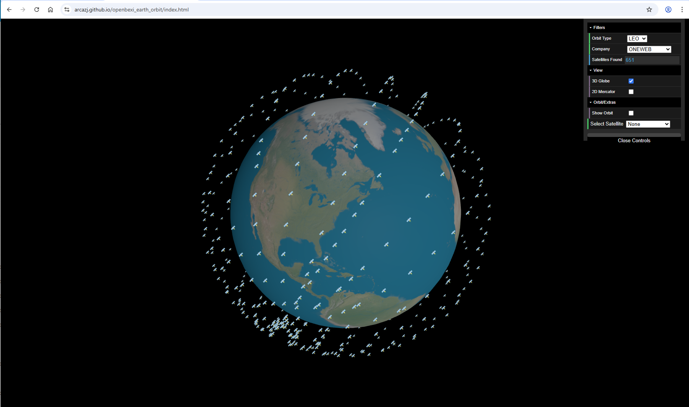
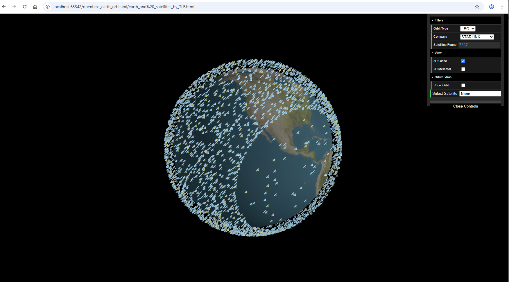

# Three.js Earth with Satellite Simulation from TLE data

This project uses Three.js and dat.GUI to simulate Earth with orbiting satellites using TLE data from [CelesTrak](https://celestrak.org/NORAD) and https://github.com/shashwatak/satellite-js (License: MIT). It visualizes satellites in LEO, MEO, and GEO with realistic 3D positioning and interactive controls.

## Live Demo

[Live Demo](https://arcazj.github.io/openbexi_earth_orbit/index.html)

# Three.js Earth with Random Satellite Simulation
The  project is a Three.js-based simulation that visualizes Earth with orbiting satellites. The simulation includes three types of satellite orbits: Low Earth Orbit (LEO), Medium Earth Orbit (MEO), and Geostationary Orbit (GEO). Users can interactively adjust the number of satellites in each orbit, as well as modify camera settings like Field of View (FOV) and Zoom.

# Constellation Examples
Below are visualizations of OneWeb and Starlink satellite constellations:  

# Features

- 3D Earth model rendered using Three.js.
- Visualization of three types of satellite orbits: Low Earth Orbit (LEO), Medium Earth Orbit (MEO), and Geostationary Orbit (GEO).
- Interactive controls using `dat.GUI` to adjust:
    - Number of satellites for each orbit type (LEO, MEO, GEO).
    - Camera settings such as Field of View (FOV) and Zoom.
- Dynamic positioning of satellites to simulate realistic orbit patterns.
- Satellites are displayed as sprites for better performance and realistic visualization.
- Adjustable inclination and rotation effects for LEO and MEO satellites.

# Roadmap
The Mercator view is still a work in progress. I haven’t yet found the right approach or the right prompt—to get helpful guidance from ChatGPT to complete it. I'm currently using the O3 version with deep thinking enabled.

# License

   This project is licensed under the MIT License - see the LICENSE file for details.

# Contributing
    Contributions are welcome! Please feel free to submit a Pull Request or open an issue to discuss changes.