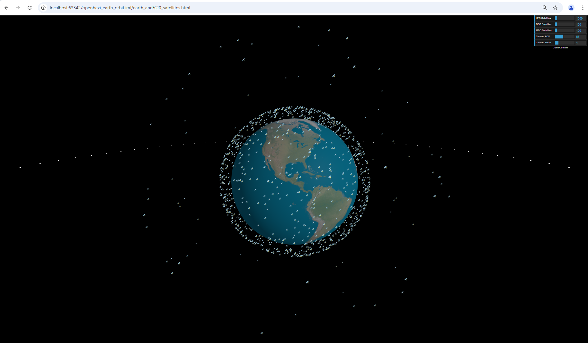
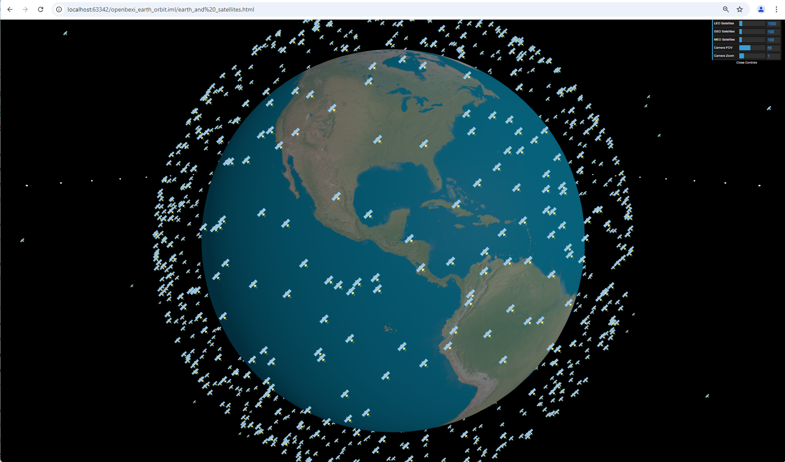

# Three.js Earth with Satellite Simulation

This project is a Three.js-based simulation that visualizes Earth with orbiting satellites. The simulation includes LEO, MEO, and GEO satellites, allowing interactive controls for adjusting satellite counts and camera settings. The project uses `dat.GUI` for easy parameter adjustment and includes realistic satellite visualization using sprites.


## Features

- 3D Earth model rendered using Three.js.
- Visualization of three types of satellite orbits: Low Earth Orbit (LEO), Medium Earth Orbit (MEO), and Geostationary Orbit (GEO).
- Interactive controls using `dat.GUI` to adjust:
  - Number of satellites for each orbit type (LEO, MEO, GEO).
  - Camera settings such as Field of View (FOV) and Zoom.
- Satellite positions dynamically generated to simulate realistic orbit patterns.
- Satellites are represented using a custom sprite image for better performance and appearance.
- Inclination and rotation effects for LEO and MEO satellites.

## Getting Started

### Prerequisites

- A modern web browser (Chrome, Firefox, Edge, Safari) that supports WebGL.
- A local server to serve the HTML file (e.g., VS Code Live Server extension, Python HTTP server).

### Installation

1. Clone the repository:
   ```bash
   git clone https://github.com/your-username/threejs-earth-satellite-simulation.git
