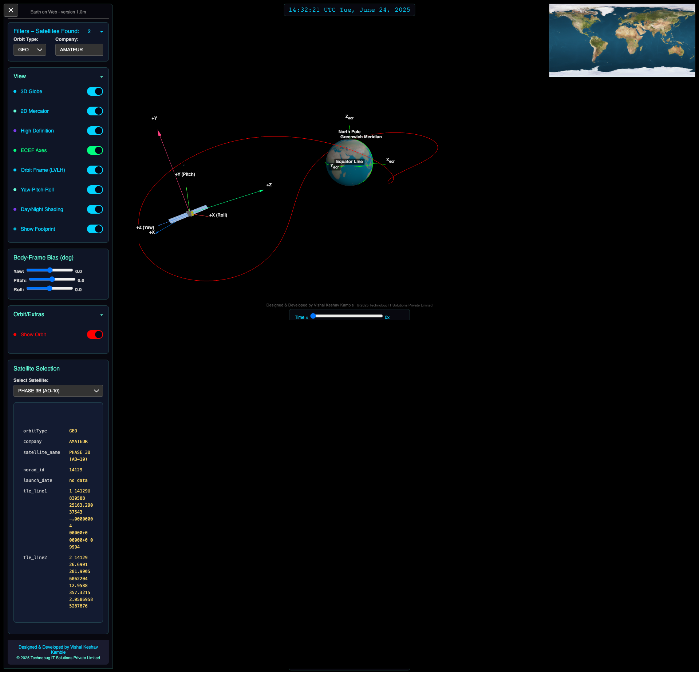
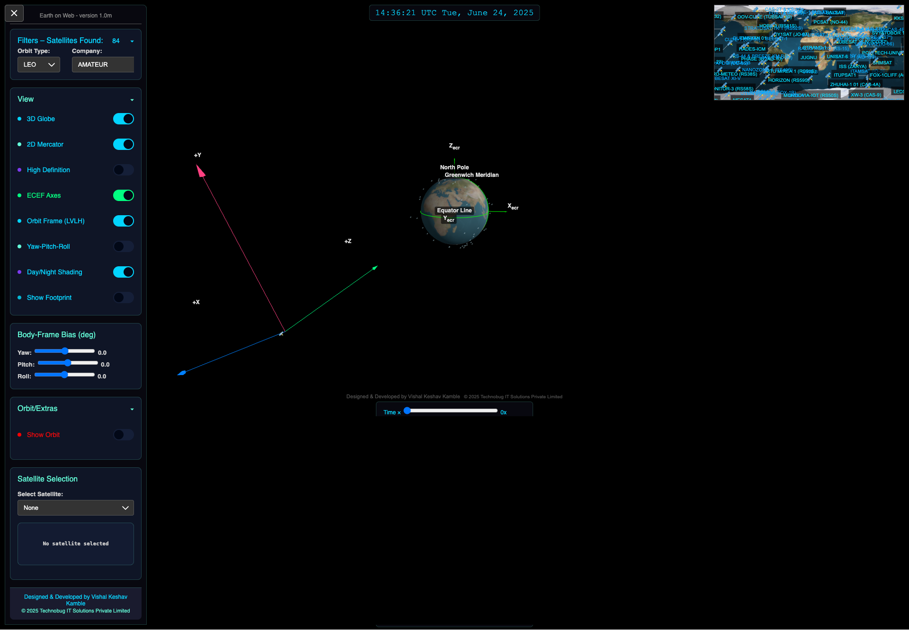
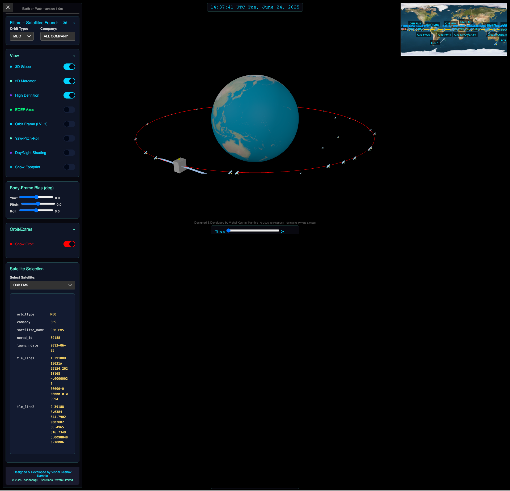
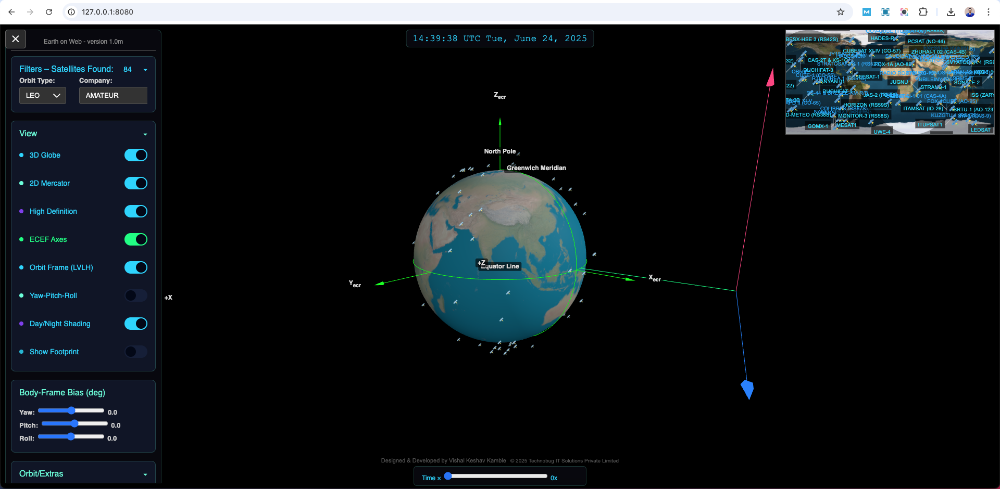
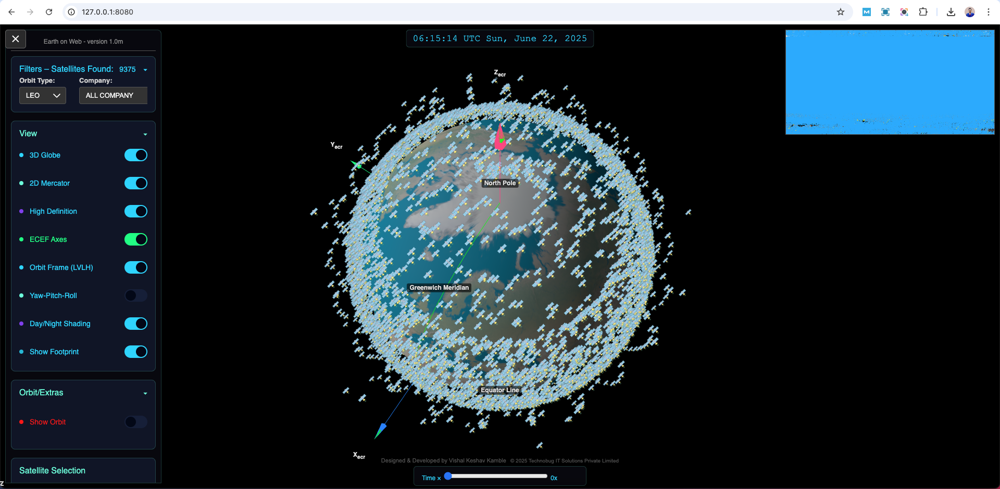
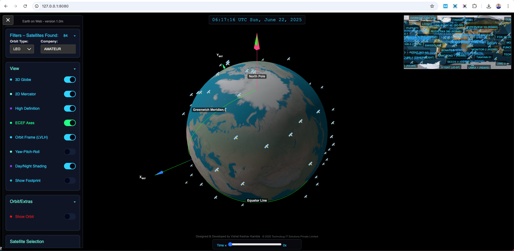
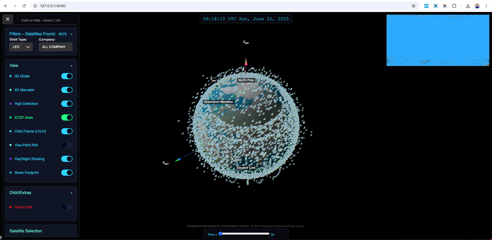
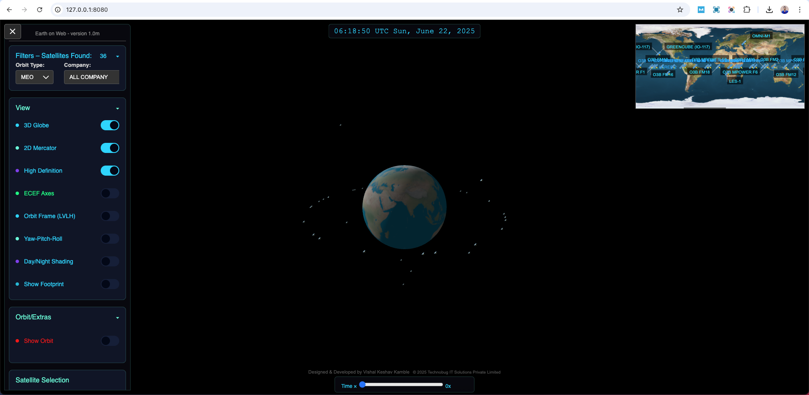
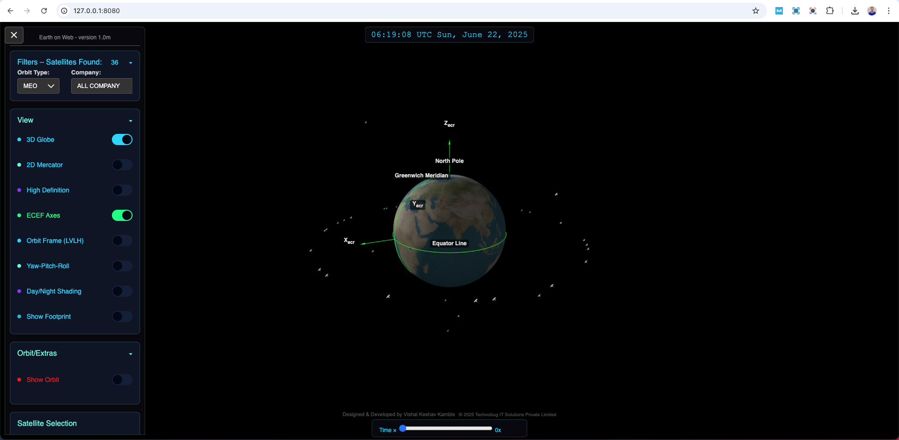

# Earth on Web

A modern web-based 3D Earth and satellite visualization platform that provides real-time tracking and visualization of satellites using TLE (Two-Line Element) data. Built with Three.js and modern web technologies, this application offers an immersive experience for exploring satellite orbits and Earth observation.

## 🌍 Live Demo

Visit [Earth on Web](https://kamblevishalkeshav.github.io/earth-on-web/)

## ✨ Features

### 3D Visualization
- Interactive 3D Earth model with high-definition textures
- Real-time satellite tracking using TLE data
- Multiple orbit types visualization (LEO, MEO, GEO)
- Satellite footprint visualization
- ECEF Axes and Orbit Frame (LVLH) visualization
- Yaw-Pitch-Roll satellite orientation controls

### Satellite Management
- Dynamic satellite filtering by orbit type
- Real-time position updates
- Detailed satellite information display
- Orbit path visualization
- Coverage area visualization for communication satellites

### User Interface
- Modern, intuitive controls using dat.GUI
- Adjustable camera settings (FOV, Zoom)
- Toggle controls for various visualizations
- Color-coded orbit displays
- Responsive design for various screen sizes

## 🛠 Technology Stack

- **Frontend Framework**: Vanilla JavaScript
- **3D Rendering**: Three.js
- **Satellite Calculations**: satellite.js
- **UI Controls**: dat.GUI
- **Data Format**: JSON
- **Styling**: CSS3

## 📦 Installation

1. Clone the repository:
```bash
git clone https://github.com/kamblevishalkeshav/earth-on-web.git
cd earth-on-web
```

2. Set up a local server (choose one):
```bash
# Using Python 3
python -m http.server

# Using Node.js
npx serve
# or
npx live-server
```

3. Open your browser and navigate to `http://localhost:8000` (or the port specified by your server)

## 🚀 Usage

1. **Basic Navigation**:
   - Use mouse to rotate the Earth
   - Scroll to zoom in/out
   - Right-click and drag to pan

2. **Satellite Tracking**:
   - Select satellites from the dropdown menu
   - Toggle orbit visualization
   - View satellite information
   - Adjust satellite orientation using YPR controls

3. **Display Options**:
   - Toggle ECEF Axes
   - Toggle Orbit Frame
   - Adjust Earth texture quality
   - Modify camera settings

## 📁 Project Structure

```
earth-on-web/
├── index.html              # Main application entry
├── css/                    # Stylesheets
├── js/                     # JavaScript modules
├── textures/              # Earth and satellite textures
├── json/                  # Configuration and TLE data
└── images/               # Project images and icons
```

## 🤝 Contributing

Contributions are welcome! Please feel free to submit a Pull Request.

## 📝 License

This project is licensed under the MIT License - see the [LICENSE](LICENSE) file for details.

## 🙏 Acknowledgments

- [CelesTrak](https://celestrak.org/NORAD) for TLE data
- [satellite.js](https://github.com/shashwatak/satellite-js) for orbital calculations
- [Three.js](https://threejs.org/) for 3D rendering
- NASA for Earth textures

## 📸 Screenshots

Here are some screenshots showcasing the application's features:


*3D Earth visualization with satellite tracking and orbit paths*


*Beam forming simulation with coverage area visualization*


*Real-time tracking of multiple satellites with orbital paths*


*Advanced satellite control interface with telemetry data*


*Satellite coverage analysis with ground station visibility*


*Detailed orbital parameters and trajectory visualization*


*Earth observation mode with high-resolution surface mapping*


*Satellite communication network visualization*


*Ground track display with satellite footprint projection*

---
[Add your screenshots here]
